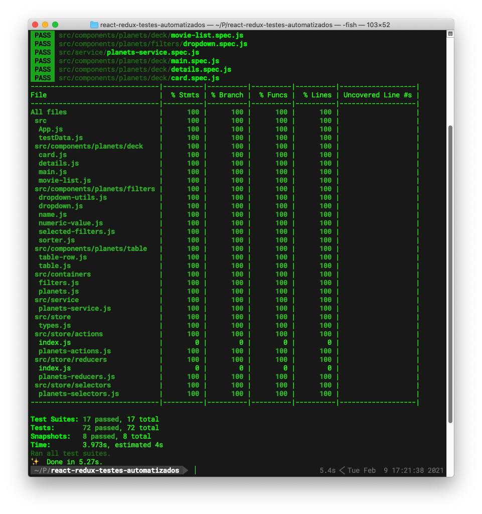

## React, Redux e testes automatizados

Esta é uma aplicação desenvolvida como um tech challenge para uma empresa do Brasil.

A aplicação em funcionamento pode ser vista em https://planet-directory-git-main.vedovelli.vercel.app

### Instalação

Basta clonar o repositório e usar sua ferramenta favorita para instalação/execução

```
npm install && npm test
```

ou

```
yarn && yarn test
```

Para demais ações basta vasculhar o `package.json`.

Você reparará que os scripts usam `craco` ao invés dos scripts react. Isso se deve a utilização do package `craco` para complementar algumas configurações sem a necessidade de ejetar a aplicação.

Use o código a vontade, especialmente como material de estudo sobre como testar os elementos Redux: actions, selectors e reducers!

A cobertura de testes está até que decente!



Ah sim: os dados vem do MirageJS. Basta olhar ali na pasta `/src/miragejs/` e caso não tenha idéia do que se trata, https://miragejs.com e https://github.com/vedovelli/miragejs-starter-kit são seus amigos!

Divirta-se!
